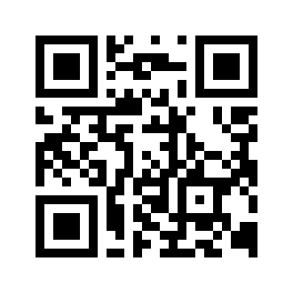

# Expo Go QR Codes

Scan with Expo Go.

## EAS Cloud Preview

Cloud URL: `exp://u.expo.dev/update/019f5748-d4e7-79bb-b214-6e4da60056b7`

QR: https://qr.expo.dev/eas-update?updateId=019f5748-d4e7-79bb-b214-6e4da60056b7

Dashboard: https://expo.dev/accounts/pidpoddev/projects/faith-canvas/updates/a3fec402-9ae5-47e9-81cb-a01cd9074c6f

## EAS iOS Development Build

Build page: https://expo.dev/accounts/pidpoddev/projects/faith-canvas/builds/856fa8e5-7022-47f7-9c3d-2543acc34670

Install artifact: https://expo.dev/artifacts/eas/OV3r7s9DcERKHxQN0G5t2Ye7blfJICygB3FTpP3Ix5k.ipa

Provisioned device: iPhone `00008150-0018589434BA401C`

LAN dev server URL: `faithcanvas://expo-development-client/?url=http%3A%2F%2F192.168.70.70%3A8082`

Manual dev server URL: `http://192.168.70.70:8082`

Tunnel note: Expo/ngrok failed on 2026-07-12 with `Cannot read properties of undefined (reading 'body')`; use LAN while the iPhone and Mac are on the same Wi-Fi.

## Local Network

Expo Go URL: `exp://192.168.70.70:8081`
